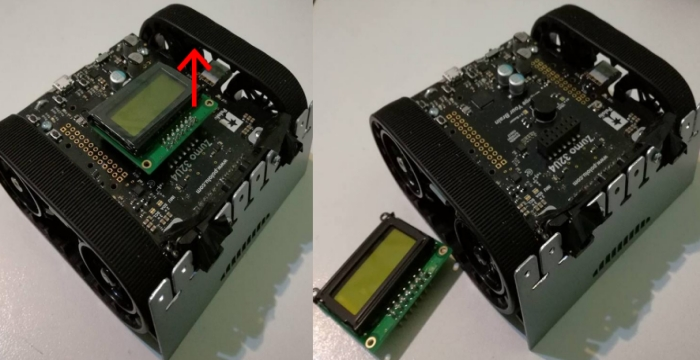
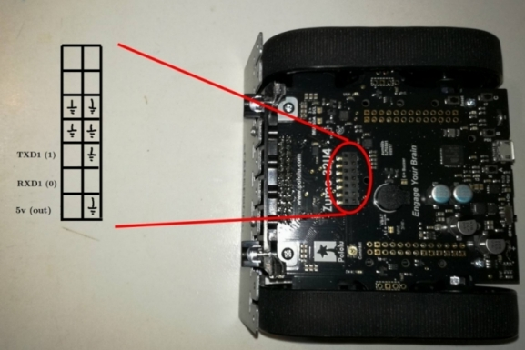
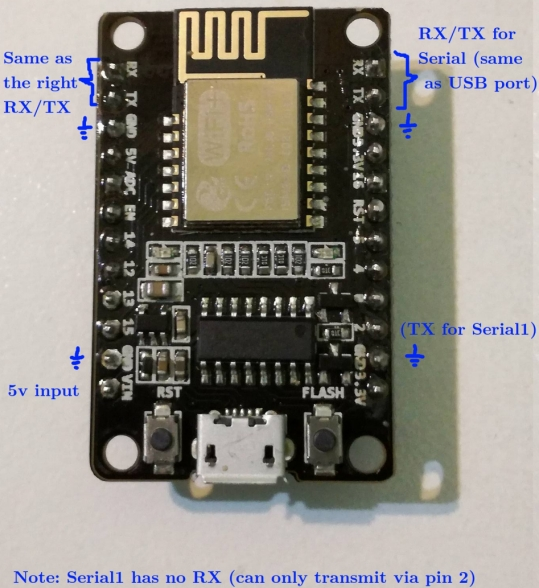
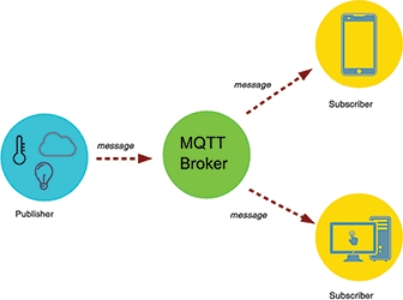
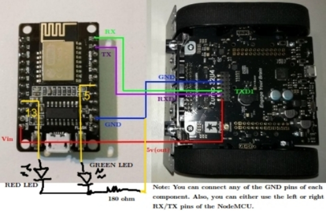

# Wi-Fi based robot's finding over ESP8285 NodeMCU

## 1. Introduction

​​​​Fill me with some intro

## 2. Preliminaries

​​​​This preliminary section is intended to briefly present the tools and devices used in our project, highlighting some related guides, tutorials and examples we found useful while working with them. As such, we do not pursue to make a deep explanation on every topic, but a quick and simple exposition of the most relevant aspects for our project. You may then want to skip some of these sections if you are already familiar with the devices described, or already know how to perform the steps detailed on them.

**Note**: You will need to have Arduino IDE installed on your machine for programming the devices used in our project. You can download Arduino IDE [directly from their website](https://www.arduino.cc/en/Main/Software?).

### 2.1. The Zumo 32U4 robot

​​​​The main ingredient of our project is Pololu's Zumo 32U4, a mini-sumo preassembled robot controlled by an Arduino-compatible ATmega32U4. Among some useful things, the Zumo 32U4 has a pair of motors with encoders, proximity IR sensors, a gyro and a micro-USB port. You can find the Zumo 32U4 user's guide [here](https://www.pololu.com/docs/0J63/all). Also, since the robot has its own easy to use library, you can find [many examples on Github](https://github.com/pololu/zumo-32u4-arduino-library/tree/master/examples). You may also want to check  the [library documentation](http://pololu.github.io/zumo-32u4-arduino-library/).

#### 2.1.1. Zumo 32U4 pinout

​​​​In order to communicate the robots between each other, we first needed to release some of the ATmega32U4 pins of the Zumo for use. We achieved  this by removing the LCD display of the robot as shown in the picture below (do not worry: the LC can be easily unplugged and plugged back again later).

​​​​Once removed, the LCD releases many pins of the robot's microcontroller. Four of those pins were needed, as marked on the image below: a GND and 5v pair of pins, which will serve as a voltage source for the ESP module (as will be explained on the latest section of this document); and pins 0 and 1 from the microcontroller, known respectively as RXD1 and TXD1. These two RX and TX pins control one of the UART serial modules of the ATmega32U4 microcontroller, hence allowing us to send and receive data to the ESP (again, explained on the latest section).

#### 2.1.2. Programming the Zumo 32U4 

​​​​For programming the Zumo 32U4 robot on your Arduino IDE, first you will have to install the Zumo board and drivers [by following these simple instructions](https://github.com/pololu/a-star), and then install the Zumo32U4 library with the IDE's Library Manager. If you don't know how to do this last thing, just [follow this steps](https://www.pololu.com/docs/0J63/6) from the Zumo robot's documentation. 

​​​​After everything has been set, we will be able to program the Zumo robot with the Arduino IDE by plugging it into an USB port. If you quickly want to test your robot, just follow the next steps for programming it with one of the examples provided with the library:

- Click on the "Tools" menu, select "Board" and then check "Pololu A-Star 32U4".
- Under the "File" menu, select "Examples" > "Zumo32U4" and click any example you would like to program. If this is the first time you are programming your Zumo, you should go with the "BlinkLEDs" example. The example .ino file should open on your Arduino IDE after choosing it.
- Select the USB port your Zumo 32U4 is connected to under "Tools" > "Port".
- Finally, compile and upload your code to the Zumo robot by clicking "Sketch" > "Upload" or the upload arrow button on the IDE button bar.

### 2.2. The ESP8285 NodeMCU

​​​​The wireless communication between robots in our project is achieved by using NodeMCU modules based on the ESP8285. This microchip has Wi-Fi capabilities with a full TCP/IP stack, being able to perform as both a TCP server or client. You can find the ESP8285 datasheet [here](https://www.espressif.com/sites/default/files/0a-esp8285_datasheet_en_v1.0_20160422.pdf) and many examples [on Github](https://github.com/esp8266/Arduino/tree/master/libraries/ESP8266WiFi/examples). In our case, we used the ESP8285 M2 NodeMCU board of DOIT, [available at Amazon](https://www.amazon.com/Makerfocus-ESP8285-Development-Compatible-ESP8266/dp/B075K48R1Q).

**Note**: Although we used ESP8285 NodeMCU modules, _any_ ESP module should work just fine for this project. As long as the same electrical connections are used, the code should work as fine as with the NodeMCU.

#### 2.2.1. NodeMCU pinout

​​​​The picture below shows the needed pins from the NodeMCU for our project. Similarly to what happened with the Zumo 32U4, we need a pair of pins for GND and 5v (to power up the module), and the RX and TX pins for communication. In this case, these two pins use the same UART module as the USB port of the board. Note the TX on pin 2 for Serial1 **cannot** be used, since it has no RX pin associated.

**Note**: If the NodeMCU module used is not the DOIT board, pinout would likely differ. As long as pin connections are kept the same, everything should work fine.

#### 2.2.2. Programming the ESP8285 NodeMCU

​​​​​Before programming the NodeMcu, you must first install the ESP board and library [following this guide](https://github.com/esp8266/Arduino/blob/master/doc/installing.rst). Once you are ready, plug your NodeMCU on some USB port and follow the next steps:

- Click on the "Tools" menu, select "Board" and then check "Generic ESP8285 Module". If you are using any other ESP module, you will have to check that particular board (and some of the next options may not be available).
- Under the "File" menu, select "Examples" > "ESP8266" > "Blink". The blinking LED example should open. Click on "Tools" > "Builtin Led" > "2" and connect an LED between GPIO 2 and GND.
- Click on "Tools" > "Reset method" > "nodemcu".
- Click on "Tools" > "Flash Size" > "1M (64K SPIFFS)".
- Select the USB port your NodeMCU is connected to under "Tools" > "Port".
- Finally, compile and upload your code to the NodeMCU by clicking "Sketch" > "Upload" or the upload arrow button on the IDE button bar. The LED you previously connected should start blinking.

#### 2.2.3. Using MQTT on the NodeMCU

​​​​Since we needed NodeMCUs to exchange messages between each other via Wi-Fi, we chose to use MQTT for that. If you are not familiar, MQTT is a [messaging protocol](https://internetofthingsagenda.techtarget.com/definition/MQTT-MQ-Telemetry-Transport) based on a publisher/subscriber system, which relies on a "broker node" for forwarding all messages to the proper client device. Basically, any client can subscribe to a topic (identified with a name) from which it wants to receive messages, and publish a message on any topic it wants. Every time a client publishes something, such message is sent to the broker, which will forward it to all other clients who have previously subscribed to that topic.

​​​​There are many MQTT implementations that can satisfy this need. For this project, we recommend [installing Mosquitto broker on a Linux machine](http://pdacontrolen.com/installation-mosquitto-broker-mqtt-in/), which will have to stay on while testing the project, although any other MQTT broker should work fine too. For the NodeMCU clients, we will be using the PubSubClient library (full documentation [here](https://pubsubclient.knolleary.net/api.html)), that can be easily installed with Arduino IDE Library Ḿanager:

- On the IDE, select "Sketch" > "Include library" > "Manage Libraries...".
- Type "PubSubClient" on the search bar.
- Install the latest version of "PubSubClient" by Nick O'Leary library.

​​​​After installing the MQTT broker and client library, you may want to test it a little. Several MQTT examples are included under "File" > "Examples" > "PubSubClient".

###  2.3. Communicating the Zumo and NodeMCU

​​​​Now that is clear how the Zumo 32U4 and the Node MCU operate, we need to electrically connect them to allow interaction with the MQTT broker from the Zumo robot. Since the NodeMCU cannot be directly plugged into the Zumo robot like the LCD display removed, we needed to make a PCB board for every robot like the one showed in the images below: 

​​​​The connections used for the PCB are detailed below. Basically, as explained when analizing the pinout of both NodeMCU and Zumo robot, we used the RX/TX UART pair for communication (RX of one device connected to TX of the other, granting data exchange), and the GND and 5v pins from the robot to power on the NodeMCU. We additionally added two LEDs on GPIOs 5 and 13 of the NodeMCU (green and red, respectively), both optional, and used only for debugging purposes (the red LED is blinked if an error occurs, and the green one if everything was successful). 

**Note**: If another ESP module is being used, you may want to add some voltage regulating circuit on the PCB for granting 3.3v to power it up instead of the 5v of the Zumo robot, [like this one](https://iot-playground.com/blog/2-uncategorised/17-esp8266-wifi-module-and-5v-arduino-connection).

​​​​This way, we can send and receive data from both Zumo 32U4 and ESP8285 NodeMCU using their respective UART modules. The many functions of [Arduino Serial](https://www.arduino.cc/reference/en/language/functions/communication/serial/) help us making this communication rather easy: by simply printing a string on Zumo Serial1, we can retrieve it on the NodeMCU with a reading from its Serial. On the other hand, we can send data from the NodeMCU to the Zumo robot by printing on the NodeMCU Serial and reading from the Zumo Serial1. 

​​​​Hence, a message sent from one robot to another follows the path of the image below. As seen, the message is first sent from the origin robot to its own NodeMCU (the one it is connected to), using their respective UART modules. The NodeMCU, which is a client for MQTT, publishes that message on some topic related to the second robot (destination robot on the picture). The MQTT broker handles that message, and forwards it to the NodeMCU on the destination robot, as long as it was a client previously subscribed to the topic of that message. The flow finishes with the NodeMCU sending the message via UART once more to the destination robot, which can finally process it.

## 3. Robot's finding in depth

Now that it is clear what devices are involved in our project and how they communicate, we can inspect in detail how our implementation works. The following sections will explain the main idea of our robot's finding distributed algorithm, and review the code on the NodeMCU and the Zumo robot.

### 3.1. Algorithm's overview

As in many other distributed system algorithms, we based our robot's finding in an initial leader election. That way, a robot will have a special leader role, while the others will remain as "lost" robots. The leader will then wander around trying to find their lost mates, achieving so by the use of the IR proximity sensors. Notice that leader and lost robots will need to exchange messages during this process (for instance, to distinguish which robot the leader found, or if the leader was seeing a robot or another object with its IR sensors). The coming sections will explain how our algorithm does that, showing the messages exchanged between robots and the little protocol adopted for determinating if a lost robot has been found.

### 3.1.1 Robot's finding flowchart

Flowchart and explanation here. Introduce UFMP.

### 3.1.2. Messaging in our algorithm

​​​​As seen in the flowchart of the previous section, the leader and lost robots need to communicate under many different scenarios. In order to easily generate and parse those various messages, we adopted a very simple format: every message is a string containing a message type, the topic related to that message (i.e. where to publish it, or where it was received from), and a payload field, which can be filled with any other useful information. These three fields are separated by a special character delimitator (for instance, '#'), making the parsing task rather easy. 

​​​​Hence, we can create any message we want from the Zumo robot with a regular string concatenation, and send it to the NodeMCU by printing on Serial1 as already discussed on the preliminary section. The NodeMCU will then receive that message, parse it to find its topic, and publish it there via the PubSubClient library. On the other hand, if the NodeMCU receives a message from the MQTT broker instead, it will only need to print it on its Serial port. The Zumo 32U4 will be able to recover it by reading Serial1, and act accordingly based on the message's type and payload.

​​​​The different message types we used in our project are the following:

- **"ESP is ready" (ERDY)**: Sent from the ESP8285 NodeMCU to the Zumo once the wireless and MQTT connection have been established. After receiving this message, the Zumo robot will start sending messages to the NodeMCU for publishing.
- **"Subscribe to topic" (SUB)**: Used by the Zumo robot to tell the NodeMCU to subscribe to some particular MQTT topic. 
- **"Unsubscribe from topic" (UNSUB)**: Works like the SUB message, but for unsubscribing from a topic.
- **"I see you" (ICU)**: This message is sent from the leader robot to all lost robots every time the first one finds something with the proximity sensors. This way, all lost robots will know the leader may be seeing one of them, and will try to see the leader on their own. 
- **"See you too" (CU2)**: Used as a reply from the lost robots to the message above. If any lost robot sees the leader, it will reply this message to it. 
- **"See you not" (CUN)**: Similar like the above, but in a negative manner (lost robot does not see the leader). 
- **"Debug message" (DEBUG)**: Message for debugging purposes only. The NodeMCU will publish all DEBUG message's payloads to a "debug topic", which can be used to trace the state of the algorithm.
- **"No message" (NONE)**: Basically, this message type is used for telling some message is no valid at all. You may think of it as a "null type" message. For instance, this type is returned when trying to parse a message type of invalid format, or when trying to read a message from the UART module with it being empty.

### 3.1.3. MQTT topics

​​​​As seen on the preliminary section, MQTT grants message forwarding using a publisher/subscriber model based on topics. The different MQTT topics we used in our project are:

- **Leader topic**: A topic to directly communicate with the leader of the group. Basically, this topic provides an abstraction layer from the leader election, allowing lost robots to talk to it without previously knowing its identity.

- **Lost robots topic**: Used for multicasting to all lost robots. A lost robot subscribes to this topic when it turns on, and unsubscribes from it when found by the leader.

- **Found robots topic**: This topic is used for communicating with all found robots. A robot subscribes to it after being found by the leader.

- **Debug topic**: As its name suggests, this topic serves debug purposes only. 

​​​​In addition to this, all robots subscribe themselves to a unique topic according to their names. This way, we can guarantee P2P communication during the steps of the UFMP, as will be described on the next section.

### 3.1.4. UFMP in detail

​​​​Explain how does UFMP work.

### 3.2. Robot's finding implementation

With the main idea of our algorithm already understood, we can now proceed to its real implementation. All code used can be found [in the Github repository for our project](https://github.com/AlejandroGarcia95/Zumo32u4-Sist-Dist-I). Although the code is already documented and references parts of this explanation, we will discuss in the next sections the most relevant aspects of it.

### 3.2.1. Our source files

The code in our repo is splitted in two separated directories, with the code suitable for the ESP8285 NodeMCU and the Zumo 32U4 on each one. Aside from the main .ino file for both devices, you will notice some other auxiliary header files, as you could expect on any C/C++ project. These different files and their purposes are detailed below.

**Header files used with ESP8285 NodeMCU**:

- *espToZumo.h*: A header file for encapsulating communication with the Zumo robot, providing a uniform messaging interface. This file allows you to create and parse messages' type, payload and topic fields in the format previously explained, and supplies simple functions to send and receive messages to and from the Zumo 32U4. This is also the file where the different message types are defined. Its sibling is the *zumoToEsp.h* file on the Zumo32U4 robot.
- *espLedsDebug.h*: A small and simple header file for debugging purposes. It only provides a function for blinking the red and green LEDs in case of failure or success.

**Header files used with Zumo 32U4**:

- *zumoMovement.h*: This useful file defines some really easy to use functions for controlling the Zumo robot's movement, as well as some experimentally measured constants for granting that simple interface. The two main functions of this library allow you either to move the robot some distance in centimeters, or to rotate it some angle in degrees (this last thing is done by using the *turnSensor.h* header file).
- *zumoProximity.h*: Mainly used during the UFMP, the functions defined on this file control the IR proximity sensor of the Zumo robot. Its two main functions allow the robot to detect an object in front of it by transmitting IR pulses, and to detect (without emitting) if such IR pulses are being received.
- *zumoToEsp.h*: A header file for encapsulating communication with the NodeMCU. It is the Zumo robot version of the *espToZumo.h* file on the NodeMCU, with exactly the same interface defined.
- *zumoLedsDebug.h*: Small and simple header file for debugging purposes. It only provides a function for blinking the red and green LEDs in case of failure or success.

### 3.2.2. ESP8285 NodeMCU code

​​​​Step by step explanation of espMain.ino

### 3.2.3 Zumo32U4 code

​​​​Step by step explanation of zumoMain.ino

## 4. Closing remarks

​​​​Some really nice conclusion

## 5. Next steps

Everything that could be done from now onwards with this

geolocation

followers in a conga line

security issues

fault tolerance