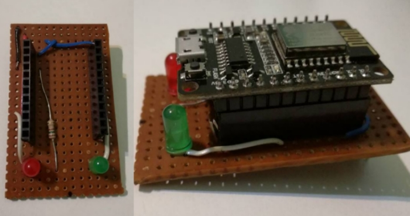
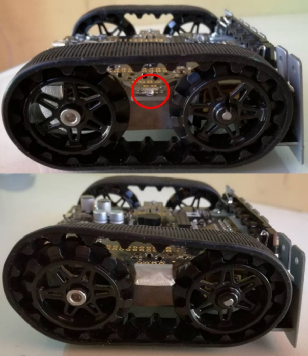

# Wi-Fi based robot's finding over ESP8285 NodeMCU

## 1. Introduction

​​​​In this project, we attempted to design and implement some mechanism for spacially-dispersed robots to find each other. Being this a distributed algorithm by nature, we had to deal with different aspects like communication and synchronization at the same time, all while considering many other constraints imposed by the electrical circuits and hardware of the robots used. 

Considering the use of Wi-Fi communication with the widely known ESP modules, we propose this robot's finding algorithm on an MQTT messaging environment and employing Zumo 32U4 robots. In the following sections, we will present the devices and technologies used, explain the key topics of our algorithm and the little protocol invented for it, and review the Arduino code developed as implementation.

## 2. Preliminaries

​​​​This preliminary section is intended to briefly present the tools and devices used in our project, highlighting some related guides, tutorials and examples we found useful while working with them. As such, we do not pursue to make a deep explanation on every topic, but a quick and simple exposition of the most relevant aspects for our project. You may then want to skip some of these sections if you are already familiar with the devices described, or already know how to perform the steps detailed on them.

**Note**: You will need to have Arduino IDE installed on your machine for programming the devices used in this project. You can download Arduino IDE [directly from their website](https://www.arduino.cc/en/Main/Software?).

### 2.1. The Zumo 32U4 robot

​​​​The main ingredient of our project is Pololu's Zumo 32U4, a mini-sumo preassembled robot controlled by an Arduino-compatible ATmega32U4. Among some useful things, the Zumo 32U4 has a pair of motors with encoders, proximity IR sensors, a gyro and a micro-USB port. You can find the Zumo 32U4 user's guide [here](https://www.pololu.com/docs/0J63/all). Also, since the robot has its own easy to use library, you can find [many examples on Github](https://github.com/pololu/zumo-32u4-arduino-library/tree/master/examples). You may also want to check  the [library documentation](http://pololu.github.io/zumo-32u4-arduino-library/).

#### 2.1.1. Zumo 32U4 pinout

In order to communicate the robots between each other, we first needed to release some of the ATmega32U4 pins of the Zumo for use. We achieved  this by removing the LCD display of the robot as shown in the picture below (do not worry: the LCD can be easily unplugged and plugged back again later).


Once removed, the LCD releases many pins of the robot's microcontroller. Four of those pins were needed, as marked on the image below: a GND and 5v pair of pins, which will serve as a voltage source for the ESP module (as will be explained on the latest section of this document); and pins 0 and 1 from the microcontroller, known respectively as RXD1 and TXD1. These two RX and TX pins control one of the UART serial modules of the ATmega32U4 microcontroller, hence allowing us to send and receive data to the ESP (again, explained on the latest section).


#### 2.1.2. Programming the Zumo 32U4 

​​​​For programming the Zumo 32U4 robot on your Arduino IDE, first you will have to install the Zumo board and drivers [by following these simple instructions](https://github.com/pololu/a-star), and then install the Zumo32U4 library with the IDE's Library Manager. If you don't know how to do this last thing, just [follow this steps](https://www.pololu.com/docs/0J63/6) from the Zumo robot's documentation. 

​​​​After everything has been set, we will be able to program the Zumo robot with the Arduino IDE by plugging it into an USB port. If you quickly want to test your robot, just follow the next steps for programming it with one of the examples provided with the library:

- Click on the "Tools" menu, select "Board" and then check "Pololu A-Star 32U4".
- Under the "File" menu, select "Examples" > "Zumo32U4" and click any example you would like to program. If this is the first time you are programming your Zumo, you should go with the "BlinkLEDs" example. The example .ino file should open on your Arduino IDE after choosing it.
- Select the USB port your Zumo 32U4 is connected to under "Tools" > "Port".
- Finally, compile and upload your code to the Zumo robot by clicking "Sketch" > "Upload" or the upload arrow button on the IDE button bar.

### 2.2. The ESP8285 NodeMCU

​​​​The wireless communication between robots in our project is achieved by using NodeMCU modules based on the ESP8285. This microchip has Wi-Fi capabilities with a full TCP/IP stack, being able to perform as both a TCP server or client. You can find the ESP8285 datasheet [here](https://www.espressif.com/sites/default/files/0a-esp8285_datasheet_en_v1.0_20160422.pdf) and many examples [on Github](https://github.com/esp8266/Arduino/tree/master/libraries/ESP8266WiFi/examples). In our case, we used the ESP8285 M2 NodeMCU board of DOIT, [available at Amazon](https://www.amazon.com/Makerfocus-ESP8285-Development-Compatible-ESP8266/dp/B075K48R1Q).

**Note**: Although we used ESP8285 NodeMCU modules, _any_ ESP module should work just fine for this project. As long as the same electrical connections are used, the code should work as fine as with the NodeMCU.

#### 2.2.1. NodeMCU pinout

​​​​The picture below shows the needed pins from the NodeMCU for our project. Similarly to what happened with the Zumo 32U4, we need a pair of pins for GND and 5v (to power up the module), and the RX and TX pins for communication. In this case, these two pins use the same UART module as the USB port of the board. Note the TX on pin 2 for Serial1 **cannot** be used, since it has no RX pin associated.


**Note**: If the NodeMCU module used is not the DOIT board, pinout would likely differ. As long as pin connections are kept the same, everything should work fine.

#### 2.2.2. Programming the ESP8285 NodeMCU

​​​​​Before programming the NodeMcu, you must first install the ESP board and library [following this guide](https://github.com/esp8266/Arduino/blob/master/doc/installing.rst). Once you are ready, plug your NodeMCU on some USB port and follow the next steps:

- Click on the "Tools" menu, select "Board" and then check "Generic ESP8285 Module". If you are using any other ESP module, you will have to check that particular board (and some of the next options may not be available).
- Under the "File" menu, select "Examples" > "ESP8266" > "Blink". The blinking LED example should open. Click on "Tools" > "Builtin Led" > "2" and connect an LED between GPIO 2 and GND.
- Click on "Tools" > "Reset method" > "nodemcu".
- Click on "Tools" > "Flash Size" > "1M (64K SPIFFS)".
- Select the USB port your NodeMCU is connected to under "Tools" > "Port".
- Finally, compile and upload your code to the NodeMCU by clicking "Sketch" > "Upload" or the upload arrow button on the IDE button bar. The LED you previously connected should start blinking.

#### 2.2.3. Using MQTT on the NodeMCU

​​​​Since we needed NodeMCUs to exchange messages between each other via Wi-Fi, we chose to use MQTT for that. If you are not familiar, MQTT is a [messaging protocol](https://internetofthingsagenda.techtarget.com/definition/MQTT-MQ-Telemetry-Transport) based on a publisher/subscriber system, which relies on a "broker node" for forwarding all messages to the proper client device. Basically, any client can subscribe to a topic (identified with a name) from which it wants to receive messages, and publish a message on any topic it wants. Every time a client publishes something, such message is sent to the broker, which will forward it to all other clients who have previously subscribed to that topic.


​​​​There are many MQTT implementations that can satisfy this need. For this project, we recommend [installing Mosquitto broker on a Linux machine](http://pdacontrolen.com/installation-mosquitto-broker-mqtt-in/), which will have to stay on while testing the project, although any other MQTT broker should work fine too. For the NodeMCU clients, we will be using the PubSubClient library (full documentation [here](https://pubsubclient.knolleary.net/api.html)), that can be easily installed with Arduino IDE Library Ḿanager:

- On the IDE, select "Sketch" > "Include library" > "Manage Libraries...".
- Type "PubSubClient" on the search bar.
- Install the latest version of "PubSubClient" by Nick O'Leary library.

​​​​After installing the MQTT broker and client library, you may want to test it a little. Several MQTT examples are included under "File" > "Examples" > "PubSubClient".

###  2.3. Communicating the Zumo and NodeMCU

Now that is clear how the Zumo 32U4 and the Node MCU operate, we need to electrically connect them to allow interaction with the MQTT broker from the Zumo robot. Since the NodeMCU cannot be directly plugged into the Zumo robot like the LCD display removed, we needed to make a PCB board for every robot like the one showed in the next images: 



​​​​The connections used for the PCB are detailed below. Basically, as explained when analizing the pinout of both NodeMCU and Zumo robot, we used the RX/TX UART pair for communication (RX of one device connected to TX of the other, granting data exchange), and the GND and 5v pins from the robot to power on the NodeMCU. We additionally added two LEDs on GPIOs 5 and 13 of the NodeMCU (green and red, respectively), both optional, and used only for debugging purposes (the red LED is blinked if an error occurs, and the green one if everything was successful). 


**Note**: If another ESP module is being used, you may want to add some voltage regulating circuit on the PCB for granting 3.3v to power it up instead of the 5v of the Zumo robot, [like this one](https://iot-playground.com/blog/2-uncategorised/17-esp8266-wifi-module-and-5v-arduino-connection).

​​​​This way, we can send and receive data from both Zumo 32U4 and ESP8285 NodeMCU using their respective UART modules. The many functions of [Arduino Serial](https://www.arduino.cc/reference/en/language/functions/communication/serial/) help us making this communication rather easy: by simply printing a string on Zumo Serial1, we can retrieve it on the NodeMCU with a reading from its Serial. On the other hand, we can send data from the NodeMCU to the Zumo robot by printing on the NodeMCU Serial and reading from the Zumo Serial1. 

Hence, a message sent from one robot to another follows the path of the image below. As seen, the message is first sent from the origin robot to its own NodeMCU (the one it is connected to), using their respective UART modules. The NodeMCU, which is a client for MQTT, publishes that message on some topic related to the second robot (destination robot on the picture). The MQTT broker handles that message, and forwards it to the NodeMCU on the destination robot, as long as it was a client previously subscribed to the topic of that message. The flow finishes with the NodeMCU sending the message via UART once more to the destination robot, which can finally process it.


## 3. Robot's finding in depth

​​​​Now that it is clear what devices are involved in our project and how they communicate, we can inspect in detail how our implementation works. The following sections will explain the main idea of our robot's finding distributed algorithm, and review the code on the NodeMCU and the Zumo robot.

### 3.1. Algorithm's overview

​​​​As in many other distributed system algorithms, we based our robot's finding in an initial leader election. That way, a robot will have a special leader role, while the others will remain as "lost" robots. The leader will then wander around trying to find their lost siblings, achieving so by the use of the IR proximity sensors. Notice that leader and lost robots will need to exchange messages during this process (for instance, to distinguish which robot the leader found, or if the leader was seeing a robot or another object with its IR sensors). The upcoming sections will explain how our algorithm does that, showing the messages exchanged between robots and the little protocol adopted for determinating if a lost robot has been found.

### 3.1.1 Robot's finding flowchart

​​​​According to what we said earlier, our robots behave like the flowchart below states. You can see that, after performing some initial leader election, a robot takes the role of leader, while the others remain on a lost state.


The "leader main" subroutine is detailed on the next flowchart. You can see that, after moving around a little, the leader robot checks if something is in front of it by using the IR proximity sensors. If the IR pulses do not bounce back, then the path is clear and the leader may continue walking. But, if they do, and the leader senses it, then it will know something is in front of it, having found perhaps a lost robot. Now, to determinate whether or not the leader has found a lost robot (and which one), our algorithm starts a little invented protocol, which we called "You Found Me Protocol" (UFMP). We will discuss it with more detail in a later section, but basically the UFMP involves some messaging and IR sensing between robots. The relevant part is, after finishing the UFMP, the leader will actually know if it was a lost robot or any other thing what was seen before.

​​​​That way, the leader will walk until something stands in its way and, via the UFMP, will be able to know if that something was a lost robot. Now, our algorithm simply loops this until all robots are found.


​​​​On the other hand, the "lost main" subroutine executed by all lost robots makes them all stand still until the leader robot finds something. At that moment, the robots will perform the lost-robot-sided version of the UFMP, in order to tell if the leader can see them or not. A lost robot will then either become found after the UFMP if the leader was really staring at it, or would remain lost waiting for the next time the leader sees something.


​​​​To sum up, the leader will be constantly wandering around for its lost fellows, and will be able to determinate or not if someone was found using the UFMP. Since this protocol and all the previous synchronization required are based over MQTT messaging system, the next sections will list what kind of messages and topics we used, before really explaining how the UFMP works.

### 3.1.2. Messaging in our algorithm

​​​​As seen in the flowchart of the previous section, the leader and lost robots need to communicate under many different scenarios. In order to easily generate and parse those various messages, we adopted a very simple format: every message is a string containing a message type, the topic related to that message (i.e. where to publish it, or where it was received from), and a payload field, which can be filled with any other useful information. These three fields are separated by a special character delimitator (for instance, '#'), making the parsing task rather easy. 

​​​​Hence, we can create any message we want from the Zumo robot with a regular string concatenation, and send it to the NodeMCU by printing on Serial1 as already discussed on the preliminary section. The NodeMCU will then receive that message, parse it to find its topic, and publish it there via the PubSubClient library. On the other hand, if the NodeMCU receives a message from the MQTT broker instead, it will only need to print it on its Serial port. The Zumo 32U4 will be able to recover it by reading Serial1, and act accordingly based on the message's type and payload.

​​​​The different message types we used in our project are the following:

- **"ESP is ready" (ERDY)**: Sent from the ESP8285 NodeMCU to the Zumo once the wireless and MQTT connection have been established. After receiving this message, the Zumo robot will start sending messages to the NodeMCU for publishing.
- **"Subscribe to topic" (SUB)**: Used by the Zumo robot to tell the NodeMCU to subscribe to some particular MQTT topic. 
- **"Unsubscribe from topic" (UNSUB)**: Works like the SUB message, but for unsubscribing from a topic.
- **"Leader election" (LDRE)**: As the name suggests, this message is used during the leader election for publishing the leader's ID to the leader election topic.
- **"I see you" (ICU)**: Starting message of the UFMP. This message is sent from the leader robot to all lost robots every time the first one finds something with the proximity sensors. This way, all lost robots will know the leader may be seeing one of them, and will try to see the leader on their own. 
- **"See you too" (CU2)**: Used as a reply from the lost robots to the message above. If any lost robot sees the leader, it will reply this message to it. 
- **"See you not" (CUN)**: Similar like the above, but in a negative manner (lost robot does not see the leader). 
- **"Debug message" (DEBUG)**: Message for debugging purposes only. The NodeMCU will publish all DEBUG message's payloads to a "debug topic", which can be used to trace the state of the algorithm.
- **"No message" (NONE)**: Basically, this message type is used for telling some message is no valid at all. You may think of it as a "null type" message. For instance, this type is returned when trying to parse a message type of invalid format, or when trying to read a message from the UART module with it being empty.

### 3.1.3. MQTT topics

As seen on the preliminary section, MQTT grants message forwarding using a publisher/subscriber model based on topics. The different MQTT topics we used in our project are:

- **Leader election topic**: Only used for determinating a leader from all robots. When starting up, all robots will publish their IDs into this topic, choosing as leader the one with the smallest ID.

- **Leader topic**: A topic to directly communicate with the leader of the group. Basically, this topic provides an abstraction layer from the leader election, allowing lost robots to talk to it without previously knowing its identity.

- **Lost robots topic**: Used for multicasting to all lost robots. A lost robot subscribes to this topic when it turns on, and unsubscribes from it when found by the leader.

- **Found robots topic**: This topic is used for communicating with all found robots. A robot subscribes to it after being found by the leader.

- **Debug topic**: As its name suggests, this topic serves debug purposes only. 

​​​​In addition to this, all robots subscribe themselves to a unique topic according to their names. This way, we can guarantee P2P communication during the steps of the UFMP, as will be described on the next section.

### 3.1.4. UFMP in detail

​​​​Recalling the flowchart describing our algorithm, the UFMP was tbe responsible of determinating the identity of objects found by the leader. Now we understand what messages and MQTT topics are involved, we can uncover UFMP working details.

According to our robot's finding algorithm, the leader had to look around for its lost partner using the IR proximity sensors incorporated on the Zumo 32U4. However, once the leader finds something, it has no way of telling if such thing was another robot or just some random object standing there:


​​​​It is at this point where the little protocol we called UFMP comes in action. According to it, the leader will have to broadcast an "I see you" message to all lost robots, which were actually waiting that to also start UFMP (as seen in our algorithm's flowcharts).


​​​​Now that leader and lost robots are sycnhronized, they can all check if they see each other. For that, the leader will remain transmitting IR pulses from its front LEDs, while the lost robots will try to sense them **without turning on their own IR LEDs**. Note how important it is to have only one robot emitting IR pulses at a time. If, let's say, the lost robots were to use their own proximity sensors by transmitting IR pulses, they could cause interference between each other.

​​​​Therefore, the leader robot will keep emitting IR pulses while the lost robots will be trying to detect them. However, it is very likely that a found robot and the leader would not be facing each other directly (i.e. front to front, LEDs against LEDs). Then, if a lost robot fails to detect IR pulses, it cannot inmediately tell the leader it was not found. Instead, the lost robot must rotate some "delta phi" angle, and then try to receive IR pulses there. Only after an entire round (360 degrees rotated), the lost robot can be certain it was not being seen by the leader.


​​​​Lost robots will then be able to answer the leader if they have detected or not the IR pulses. The "I see you too" and "See you not" messages previously mentioned are used for this purpose.

### 3.2. Robot's finding implementation

​​​​With the main idea of our algorithm already understood, we can now proceed to its real implementation. All code used can be found [in the Github repository for our project](https://github.com/AlejandroGarcia95/Zumo32u4-Sist-Dist-I). Although the code is already documented and references parts of this explanation, we will discuss in the next sections the most relevant aspects of it.

### 3.2.1. Our source files

​​​​The code in our repo is splitted in two separated directories, with the code suitable for the ESP8285 NodeMCU and the Zumo 32U4 on each one. Aside from the main .ino file for both devices, you will notice some other auxiliary header files, as you could expect on any C/C++ project. These different files and their purposes are detailed below.

**Header files used with ESP8285 NodeMCU**:

- *espToZumo.h*: A header file for encapsulating communication with the Zumo robot, providing a uniform messaging interface. This file allows you to create and parse messages' type, payload and topic fields in the format previously explained, and supplies simple functions to send and receive messages to and from the Zumo 32U4. This is also the file where the different message types are defined. Its sibling is the *zumoToEsp.h* file on the Zumo32U4 robot.
- *espLedsDebug.h*: A small and simple header file for debugging purposes. It only provides a function for blinking the red and green LEDs in case of failure or success.

**Header files used with Zumo 32U4**:

- *zumoMovement.h*: This useful file defines some really easy to use functions for controlling the Zumo robot's movement, as well as some experimentally measured constants for granting that simple interface. The two main functions of this library allow you either to move the robot some distance in centimeters, or to rotate it some angle in degrees (this last thing is done by using the *turnSensor.h* header file).
- *zumoProximity.h*: Mainly used during the UFMP, the functions defined on this file control the IR proximity sensor of the Zumo robot. Its two main functions allow the robot to detect an object in front of it by transmitting IR pulses, and to detect (without emitting) if such IR pulses are being received.
- *zumoToEsp.h*: A header file for encapsulating communication with the NodeMCU. It is the Zumo robot version of the *espToZumo.h* file on the NodeMCU, with exactly the same interface defined.
- *zumoLedsDebug.h*: Small and simple header file for debugging purposes. It only provides a function for blinking the red and green LEDs in case of failure or success.

### 3.2.2. ESP8285 NodeMCU code

​​​​After reviewing this project's structure, we can now focus on the .ino file for the ESP8285 NodeMCU. Yay! You will be able to see it beginning with the next few lines:

```c++
// ---------------- WIFI CONNECTION CONSTANTS ----------------

#define WIFI_NETS 3 // Change when adding more networks

#define CONNECTION_ATTEMPTS 8
#define CONNECTION_DELAY 900

#define MQTT_SERVER_IP "192.168.0.7"
#define MQTT_SERVER_PORT 1883

const char* ssid[] = {"Telecentro-40a8", "Speedy-Fibra-BF992E", "HUAWEI P9 lite", "Add your WiFi net here"};
const char* password[] = {"DDZ2WNHZ2NKN", "98A896E433FeA5BcF544", "ipv6isgood", "And its password here"};
```

The easiest part to understand are the MQTT constants defined for the connection: MQTT_SERVER_IP and MQTT_SERVER_PORT just define the broker IP address and port the ESP will be trying to connect to. Now, the next of the constants are for satisfying Wi-Fi connectivity, as seen on the next function of the file:

```c++
/* Connects to a WiFi network available from the ssid array. 
For such, performs CONNECTION ATTEMPTS attempts for connecting,
with a CONNECTION_DELAY delay of time between them. Logs to 
serial if connection was successful or not, showing IP address.*/
void setupWifi() {
  int attempts = 0;
  for(int i = 0; i < WIFI_NETS; i++){
    serialPrint("\nTrying to connect to " + String(&ssid[i][0]));
  
    WiFi.begin(&ssid[i][0], &password[i][0]);

    while(WiFi.status() != WL_CONNECTED) {
      delay(CONNECTION_DELAY);
      attempts++;
      if(attempts == CONNECTION_ATTEMPTS) {
        serialPrint("Connection attempt failed");
        attempts = 0;
        break;
      }
    }

    if(WiFi.status() == WL_CONNECTED) {
     serialPrint("\nWiFi connected");
      serialPrint("IP address: " + String(WiFi.localIP()));
      return;
    }
      
  }

  // If here, we could connect to no network
  serialPrint("\nWiFi has never conected!");
  showLedsDebug(false);
}
```

As you can see, the function iterates over the ssid array calling the *Wifi.begin* function, thus attempting a connection. If that connection is refused CONNECTION_ATTEMPTS times, the function will try to connect to the next network on the array. This is, then, a mere trick of us for beginning the Wi-Fi connection withouth needing to change the network name and password every time we changed location. If you know you are only using one Wi-Fi network for testing the project, you may want to erase the array and just keep things simple.

Going on with our analysis, we will see the *reconnect* function, in charge of reconnecting the NodeMCU with the MQTT broker if connection gets lost. We can see such connection is done with the *client.connect* function call, with a unique espId field to identify this device from others. The two other fields are the "userId" and "password" for MQTT, which you may like to change if seeking some security level.

```c++
/* Attemtps a reconnection with MQTT if this client
connection went lost. Attempts to reconnect after
2 seconds.*/
void reconnect() {
  // Loop until we're reconnected
  while (!client.connected()) {
    serialPrint("Attempting MQTT connection");
    // Attempt to connect
    if (client.connect(espId, "esp8266_1", "1234")) {
      serialPrint("Connected!");
      // ... and resubscribe
      client.subscribe(espId);
    } else {
      serialPrint("Failed! rc= " + String(client.state()));
      serialPrint("Trying again in 2 seconds");
      // Wait 2 seconds before retrying
      delay(2000);
    }
  }
}
```

The next function in the file is the *callback* function, which (as its name suggests) will be automatically called right after the NodeMCU receives a message from the MQTT broker:

```c++
/* MQTT juicy part: callback function to be called when a
new message arrives on ANY topic.*/
void callback(char* topic, byte* payload, unsigned int length) {
  // Retrieve the message on a String object
  char tmpBuffer[50] = {0};
  for(int i = 0; i < length; i++)
    tmpBuffer[i] = (char) payload[i]; 
  String msg = tmpBuffer;
  
  // Now retrieve message type
  String msgType = getMessageType(msg);

  if(msgType == MSG_NONE){
    showLedsDebug(false);
  }
  else {
    sendToZumo(msg);
    showLedsDebug(true);
  }
}
```

​​​​Since the message received on the NodeMCU was originally sent from another Zumo robot, we can see that, after performing a little String conversion and some error checking, the function only needs to forward that message to the robot this ESP8285 NodeMCU is connected to.

​​​​Moving into the *setup* function of the .ino file, we can see the callings of the previous *setup* and *reconnect* functions, aside from some configuration of the PubSubClient library involving the *callback* and MQTT_SERVER constants:

```c++
void setup(void){
  setupLedsDebug();
  setupToZumo();
  setupWifi();
  client.setServer(MQTT_SERVER_IP, MQTT_SERVER_PORT);
  client.setCallback(callback);
  delay(100);
  reconnect();
  // Tell the Zumo this ESP is ready
  sendToZumo(createMessage(MSG_ERDY, "", String(espId)));
  showLedsDebug(true);
}
```

​​​​We can see above that the NodeMCU first connects to some Wi-Fi network and then to the MQTT broker (the calls to *setupLedsDebug* and *setupToZumo* are setup functions of the header files related to the NodeMCU, described on the previous section). When finished, the device sends to the Zumo robot the message "ESP is ready", and becomes available for use.

​​​​This way, we can finally look into the *loop* function code, which will have the task of handling messages received from the Zumo 32U4 (remember messages received from the MQTT broker are already handled on the *callback* function).

```c++
void loop(void){
  // MQTT stuff handling
  if (!client.connected()){
    reconnect();
  }
  client.loop();

  // Receives a message from zumo and publishes it
  String msg = receiveFromZumo();
  String msgType = getMessageType(msg);
  String msgTopic = getMessageTopic(msg);
  String msgPayload = getMessagePayload(msg);
  if(msgType == MSG_NONE)
    // Happens only on error
    showLedsDebug(false);
  else {
    serialPrint("Msg received: [" + msgType + "," + msgPayload + "," + msgTopic + "]");
    // Get topic for publishing or subscribing
    char topicBuffer[20] = {0};
    msgTopic.toCharArray(topicBuffer, msgTopic.length() + 1);
    
    // Switch on msgType
    char msgBuffer[50] = {0};
    if(msgType == MSG_SUB) {
      client.subscribe(topicBuffer);
      showLedsDebug(true);
    }
    else if(msgType == MSG_DEBUG){
      msgPayload.toCharArray(msgBuffer, msgPayload.length() + 1);
      client.publish(topicBuffer, msgBuffer);
      showLedsDebug(true);
    }
    else{
      msg.toCharArray(msgBuffer, msg.length() + 1);
      client.publish(topicBuffer, msgBuffer);
      showLedsDebug(true);
    }

  }
}
```

​​​​The very simple code then performs some action based on the message type: when receiving some SUB or UNSUB message, the NodeMCU will subscribe or unsubscribe to that topic; when receiving a DEBUG message, it will publish the message payload into the debug topic; and on any other case, the NodeMCU will just act as a dispatcher, forwarding the message recieved into the message topic. 

​​​​To sum up, all the code above allows the ESP8285 NodeMCU to connect to a Wi-Fi network and the MQTT broker, and puts it in the service of the Zumo robot. The Zumo 32U4 connected to it will then be able to subscribe, unsubscribe and publish messages via MQTT using the NodeMCU as its middleman.

### 3.2.3 Zumo32U4 code

Finally, the time has come to review the .ino file's code of the Zumo 32U4. Like the espMain.ino file, this one starts with a lot of constants and other definitions:

```c++
// Special topics used for our protocols

const String LDR_ELECTION_TOPIC = "election";
const String LOST_TOPIC = "lost";
const String LEADER_TOPIC = "leader";

// Global IDs for our protocols

const int robotsAmount = 4; // Including leader
const int myRobotId = 0;
const String ROBOT_NAMES[] = {"Cassandra", "Maria", "Mongo", "Neo"};

// Various constants for the protocols

#define LDR_ELECTION_TIMEOUT 9000 // Used for leader election
#define DRAIN_ATTEMPTS 20 // Used by drainMode
#define SOURCE_TRANSMIT_DELAY 40 // Used by sourceMode
#define DELTA_PHI 12 // Used for UFMP
#define DODGING_ANGLE 30 // Used to dodge obstacles
#define SPIRAL_CELL 5 // Used in spiralWalk
```

​​​​We can see declared some of the topics we have talked about before, as well as the amount of robots used and a robot ID relative to an array of names. This way, every robot can subscribe to a unique topic for itself, using its own name. We can also see other constants defined, like the "delta phi" angle used by lost robots during the UFMP, or the timeout for the leader election (we will be talking about the other constants later).

​​​​We have also defined some useful macros as can be seen below. The *ROBOT_ID_TO_NAME* macro allows us to retrieve a robot's name based on its ID, the *SUBSCRIBE_TO* and *UNSUBSCRIBE_FROM* enables MQTT subrscription and unsubscription from the Zumo robot (by sending a MSG_SUB or MSG_UNSUB to the ESP), and the *SAY* macro will publish to the debug topic a message formatted like if the robots were chatting (we wanted messages like "Mongo: I have connected" on the debug topic to make it easier to trace every robot state). 

```c++
// Fancy macros

#define ROBOT_ID_TO_NAME(id) (ROBOT_NAMES[id])
#define SAY(msg) sendDebugMessage(ROBOT_ID_TO_NAME(myRobotId) + ": " + msg)

#define SUBSCRIBE_TO(topic) (sendToEsp(createMessage(MSG_SUB, "", topic)))
#define UNSUBSCRIBE_FROM(topic) (sendToEsp(createMessage(MSG_UNSUB, "", topic)))
```

​​​​Going on a little ahead, we can inspect the file's *loop* and *setup* functions. This last one begins calling the configuration functions of the header files we created and already described, leaving everything ready for using, and then calls *waitForEsp*. As you may imagine, *waitForEsp* makes the Zumo robot await the ESP8285, which will send a message to the Zumo once connected to MQTT (remember the *setup* of the espMain.ino file). After this, the *setup* function makes the robot subscribe to its unique topic, and the leader election is performed to determinate which robot may be the leader. Depending on the result of this election, the *loop* function will make the robot act as a leader or lost robot.

```c++
// ---------------------------- MAIN PROGRAM ----------------------------

// Called only once when robot starts
void setup(){
  setupZumoMovement();
  Serial.begin(9600);
  setupToEsp();
  setupProximity();
  setupLedsDebug();
  waitForEsp();
  subscribeToSelfTopic();
  ledYellow(0);
  SAY("I have connected");
  showLedsDebug(true);
  leaderElection();
}

void loop(){
  // Pretty straight forward
  if(imLeader)
    leaderMain();
  else
    lostMain();
}
```

​​​​The code of *waitForEsp* and *subscribeToSelfTopic* is really simple and short as you could expect:

```c++
/* Starting function for subscribing every robot to its own topic. */
void subscribeToSelfTopic(){
  SUBSCRIBE_TO(ROBOT_ID_TO_NAME(myRobotId));
}

/* Waits for the ESP to be ready for communication. Just makes the robot
  wait for the ERDY message from the ESP. */
void waitForEsp(){
  Serial.println("\nWaiting for ESP to be ready...");
  String msg = receiveFromEsp();
  while(getMessageType(msg) != MSG_ERDY){
    delay(30);
    msg = receiveFromEsp();
  }
  Serial.println("ESP is ready!");
}
```

​​​​On the other hand, the *leaderElection* function is a little longer. While executing this function, the robots will subscribe and publish their own robot IDs to the leader election topic, choosing as their leader the one with smallest ID value. The leader election will allow new robots to join the election during an amount of time defined as LDR_ELECTION_TIMEOUT. 

```c++
/* Initial leader election to determinate which robot will have to 
  look for the others. Basically, all robots publish their robotId
  to the LDR_ELECTION_TOPIC and the one with smaller robotId becomes
  the leader. Note the election will finish after LDR_ELECTION_TIMEOUT
  miliseconds after the last message received on LDR_ELECTION_TOPIC. */
void leaderElection(){
  SAY("I'm voting in the leader election");
  int leaderId = myRobotId;
  SUBSCRIBE_TO(LDR_ELECTION_TOPIC);
  // Publish own id as leader
  String msg = createMessage(MSG_LDRE, String(leaderId), LDR_ELECTION_TOPIC);
  sendToEsp(msg);

  // Wait a while checking if a better leader shows up
  unsigned long lastMsgTime = millis();
  while((millis() - lastMsgTime) < LDR_ELECTION_TIMEOUT){
    msg = receiveFromEsp();
    if(getMessageType(msg) == MSG_NONE)
      delay(30);
    else if(getMessageType(msg) == MSG_LDRE){
      lastMsgTime = millis();
      int newId = getMessagePayload(msg).toInt();
      if (newId <= leaderId) // There's a better leader
        leaderId = newId;
      else{ // I Know a better leader
        msg = createMessage(MSG_LDRE, String(leaderId), LDR_ELECTION_TOPIC);
        sendToEsp(msg);
      }
    }

  }

  UNSUBSCRIBE_FROM(LDR_ELECTION_TOPIC);
  if(leaderId == myRobotId){
    imLeader = true;
    SAY("I am the leader");
    SUBSCRIBE_TO(LEADER_TOPIC);
    // Give lost robots some time to enter lost state
    delay(LDR_ELECTION_TIMEOUT / 3);
  }
  else
    SAY("All hail the leader " + ROBOT_ID_TO_NAME(leaderId));

}
```

​​​​Now, we need to check the *leaderMain* and *lostMain* functions of the file. Recalling the algorithm's flowchart, lost robots were to stand still until the leader found something. At that time, the UFMP would enter in action and lost robots would try to see the leader on their own, by sensing the IR pulses emitted by it. As it was *very* important to distinguish these two roles (the IR pulses emitter and the non-transmitting detector), we called them in our implementation as "source" and "drain". Thus, we encapsulated this behaivour in two functions:

```c++
// ---------------------- AUXILIAR FUNCTIONS ----------------------

/* Turns the robot into source mode, making it emit IR pulses with a
  delay of SOURCE_TRANSMIT_DELAY between each consecutive transmition.
  This function will make the robot emit pulses until a message arrives
  from the ESP, returning it as a String. */
String sourceMode(){
  SAY("Turning LEDs on and waiting for response...");
  String msg = receiveFromEsp();

  while(getMessageType(msg) == MSG_NONE){
    objectIsInFront();
    delay(SOURCE_TRANSMIT_DELAY);
    msg = receiveFromEsp();
  }

  return msg;
}

/* Turns the robot into drain mode, passively sensing IR without emiting
  pulses. This function makes the robot rotate delta_phi degrees clockwise
  before performing DRAIN_ATTEMPTS attempts of IR pulses detection. If any
  of these attempts detects IR pulses, the function returns true WITH THE
  ROBOT STANDING IN THAT POSITION (i.e. the robot will be facing towards
  the IR pulses' source). If no IR pulses were ever detected after having
  rotated 360 degrees, the function returns false.*/
bool drainMode(int delta_phi){
  for(int i = 0; i <= 360; i += delta_phi){
    rotate(delta_phi, true);

    for(int i = 0; i < DRAIN_ATTEMPTS; i++)
      if (detectIRPulses())
        return true;
  }

  return false;
}
```

​​​​With the above functions, a robot in drain mode will constantly be rotating and trying to detect IR pulses, trying DRAIN_ATTEMPTS times such detection. When an entire round is finished (360 degrees), the function can guarantee no IR pulses are hitting the robot. On the other hand, a robot in source mode will transmit IR pulses every SOURCE_TRANSMIT_DELAY miliseconds, until a message arrives from the ESP.

​​​​The *leaderMain* function can then make use of the *sourceMode* function after finding something, and sending the ICU message to all lost robots. Since *sourceMode* finishes when a message arrives, the leader robot will have to call it as many times as remaining lost robots. This is represented by the while loop with condition `robotsReplies < (robotsAmount - robotsFound - 1)`:

```c++
/* Main function for the leader robot. The leader's mission is
  to walk around trying to find the lost robots. Every time
  something is seen with the proximity sensors, the leader will
  start the UFMP by multicasting an ICU message to all lost robots.
  By collecting all lost robot's answers, the leader can know if
  it found a lost robot, or an obstacle (and will dodge it).
  This is repeated until all lost robots are found. */
void leaderMain(){
  SAY("I am looking for robots");
  int robotsFound = 0;
  // Continue while there are robots left
  while(robotsFound < (robotsAmount - 1)){
    // Move until something is found
    spiralWalk();

    // UFMP: Found something, tell all lost robots
    SAY("I see something");
    String msg = createMessage(MSG_ICU, "", LOST_TOPIC);
    sendToEsp(msg);

    // Wait for lost robots to reply
    int robotsReplies = 0;
    bool foundSomeone = false;
    while(robotsReplies < (robotsAmount - robotsFound - 1)){
      msg = sourceMode();
      if (getMessageType(msg) == MSG_CU2){
        delay(1000);
        SAY("I found " + getMessagePayload(msg) + "!");
        robotsReplies++;
        robotsFound++;

        foundSomeone = true;
      }
      else if(getMessageType(msg) == MSG_CUN){
        delay(1000);
        SAY("I haven't found " + getMessagePayload(msg) + " as they can't see me");
        robotsReplies++;
      }
    }

    // Allow the found robot to leave stage or dodge obstacle accordingly
    if(foundSomeone){
      delay(2600); // Allow the found robot to step aside
      if((robotsAmount - robotsFound) > 1)
        SAY("I still need to find " + String(robotsAmount - robotsFound - 1) + " lost robots");
    } else {
      SAY("What I found was not a robot fella");
      rotate(DODGING_ANGLE, true);
    }

  }

  // All robots were found
  SAY("I finally found all my robot mates");
  ledYellow(1);
  ledRed(1);
  ledGreen(1);
  while(1)      // Nice to have: sleep mode or
    delay(3000);// do smth now that was found 
}
```

​​​​In the mentioned loop, you can see the function handles the message type and acts accordingly: if the lost robot replies with a CU2 message, then the leader knows it has found a robot, and which one. In case no robot was found, then what the leader saw was a random object, and the function will make it dodge it by rotating some angle of DODGING_ANGLE degrees. This whole process is repeated until all robots are found, as discussed when explaining the algorithm, with the leader moving around for discovering its mates. 

In order to ensure the leader will eventually find all robots, we needed a walking function able to cover all space. Our *spiralWalk* function does that by making the leader move like in a [squared spiral inside a grid](https://www.researchgate.net/profile/Warren_Flack/publication/237256827/figure/fig1/AS:359895946809345@1462817288395/Square-spiral-search-routine-used-by-the-MVS.png). Of course, many other functions would help, too, but we found this *spiralWalk* really simple and useful.

```c++
/* Walking function for the leader to cover the whole space in a spiral-shaped
  path. The spiral will be considered as "squared", like inside a grid, with
  every cell of size SPIRAL_CELL cm. This function makes the leader walk the
  squared spiral until something is detected with the proximity sensors. */
int spiral_steps = 1;
int spiral_stage = 0;
int spiral_act = 0;

void spiralWalk(){
  long rnd;
  bool found = false;
  while(!found){
    delay(1000);
    if (spiral_act < spiral_steps){
      moveDistanceInTime(SPIRAL_CELL, 2, false);
      spiral_act++;
    } else{
      // Rotating
      spiral_act = 0;
      rotate(48, true);
      rotate(47, true);
      if (spiral_stage % 2 == 1){
        spiral_steps++;
      }
      spiral_stage++;
    }

    if (objectIsInFront()){
      found = true;
    }
  }
}
```

The last function to review is *lostMain*, which is presented below. On it, the lost robot basically stands still until the message ICU is received from the leader. At this point, the lost robot side of the UFMP makes it enter drain mode, so as to check if the robot can sense the IR pulses of the leader or not. After the *drainMode* call, the robot can send the proper answer to the leader and, in case of becoming a found robot, leave stage and unsubscribe itself from the lost robots topic.

```c++

/* Main function for a lost robot. All lost robots will wait for
  the leader to see something, and then start the UFMP to check
  if they can see the leader too by sensing the IR pulses emitted
  from it. The proper answer will be forwarded to the leader, and
  the robot will "leave stage" after being found. */
void lostMain(){
  SUBSCRIBE_TO(LOST_TOPIC);
  SAY("Entering IDLE state");
  String msg = receiveFromEsp();;

  // Be a lost robot until the leader finds me
  bool imSeen = false;
  while(!imSeen){
    // Wait for the leader to see something
    while(getMessageType(msg) != MSG_ICU){
      delay(30);
      msg = receiveFromEsp();
    }
    // UFMP: check if I can see the leader too
    SAY("Leader saw something, checking if it was me...");
    if(drainMode(DELTA_PHI)){
      msg = createMessage(MSG_CU2, ROBOT_ID_TO_NAME(myRobotId), LEADER_TOPIC);
      sendToEsp(msg);
      SAY("Hey, you found me!");
      imSeen = true;
    }
    else{
      msg = createMessage(MSG_CUN, ROBOT_ID_TO_NAME(myRobotId), LEADER_TOPIC);
      sendToEsp(msg);
      SAY("Nope, it was not me!");
    }

  }

  // Exit from stage as I was already found
  UNSUBSCRIBE_FROM(LOST_TOPIC);
  ledYellow(1);
  ledRed(1);
  ledGreen(1);
  delay(500);
  moveDistanceInTime(60, 6, true);
  while(1)      // Nice to have: sleep mode or
    delay(3000);// do smth now that was found 
}
```


## 4. Robot's finding in action

​​​​After a really long explanation of our project, finally the time has come for watching some action! However, when trying to test this by yourself, you may find some problems with the IR proximity sensors. Hence, before jumping into programming the robots, you may want to read the following advice: **Zumo 32U4 robots may have a bad time detecting each other since they are black**. 

​​​​As you had surely heard, light (and, of course, IR pulses) bounces back better on white surfaces, but not on black ones. This makes things difficult for the leader robot, which cannot easily detect its mates if they are not facing it directly. In other words, it is very unlikely for the leader to "see" another lost robot from the side or the back.  

​​​​One simple way we found to prevent this from happening was covering some parts of the robots with white tape. Although it is not the latest trend in robot's fashion, this really meant an improvement in IR detection.


​​​​Another nice solution we found was building a kind of "box" around the NodeMCU over the robot. By making this box white, IR reflection can also be granted.


​​​​You may want to use white tape for covering the left and right IR sensors of the robots, too. This will force the robots to "see" each other front to front and not by the side:



​​​​Now, we have everything ready for trying out the robot's finding algorithm. You will have to program all of your ESP8285 NodeMCU and Zumo 32U4 robots like explained in the preliminary section (remember that you will have to change the IDs of both the ESP and the robot in the first lines of the code files to be unique), and have the MQTT broker running on the same IP address and port as defined in the espMain.ino file. By running on a terminal the command `mosquitto_sub -t debug` you can log the messages published on the debug topic by all robots, thus being able to trace all algorithm's steps.


A full video of the robot's finding can be found [here](https://www.youtube.com/watch?v=UtYlBuLUE_0&feature=youtu.be). You will be able to see the different parts of our algorithm briefly explained over a real testing scenario. 


## 5. Closing remarks

​​​​In conclusion, we were able to successfully propose and implement a robot's finding algorithm over Arduino programmable ESP8285 Wi-Fi modules and Zumo 32U4 robots, ensuring a messaging system by using their UART modules and MQTT, and developing a small protocol based on the IR proximity sensors for dodging obstacles and determinating the identity of the robot found. As discussed in the introduction, being this problem of distributed nature, many inherent difficulties of distributed systems arise, some of which we consider have been overcome on this project. Nevertheless, much more could be done, and we hope this project could serve as a starting point for that goal.

## 6. Next steps

​​​​Due to several factors (especially time constraints), we had to leave many different things out of our project. These "nice to have" features include: 

- Some *geolocation system* for all robots to constantly monitor their positions. Such an improvement would make the robot's finding more optimal, since the leader will be able to move directly to their lost peers. Although we tried this at first, we quickly left it out because most ESP geolocation projects used the Google Maps API, with distance errors considerably bigger than the robot's size.
- An algorithm's modification according to some *faul tolerant* approach (considering more robots are involved). Like in all distributed systems, the devices and the network involved are not perfect, and an unexpected error would turn the whole system useless. An easy way of start managing it may be MQTT "keep alive" and "last will" messages, which can help to automatically track any robot going down. That way, for instance, any found robot could carry on finding their lost mates if the leader went dead of batteries, or the leader would not need to wander around forever trying to find a robot whose connection got lost.
- A *leader-following* scheme for all found robots, in the sense of a little swarm algorithm. Initially, we wanted all found robots to follow the leader steps like in a conga line (you can actually find unused but defined message types for this in our code), but this resulted difficult for us in practice. Adding this would be really nice, since it could allow all robots to perform some task after being gathered by their leader.
- Any *memoization strategy* for the leader's walking, that may help it avoiding places where it has been before, or evading previously identified obstacles.
- Some minor *security issues*, including MQTT user id and password, robots being able to logging in and out, messaging encryption, etc.

Alternatively, one could take advantage of the communicational habilities of the NodeMCU combined with MQTT and the many sensors of the Zumo robot to craft some other cool projects. Here are some ideas we came up with:

- A leader robot performs some task, and asks help "on demand" to the other robots. For example, the leader pushes away some obstacles on its own, until it finds something so big that help from its mates is required.
- The robots adopt some formation around a valuable item they need to protect from an enemy. If someone gets too close, the closest robot will push them away. If any robot "falls in combat", the others should rearrange themselves to keep the formation stable.
- All robots carry some sensor for measuring anything that would be dangerous for human beings, and coordinate to cover the whole "riskful area".  Combined with geolocation this could be used, for instance, for tracking gas leaks on buildings or other closed spaces.

